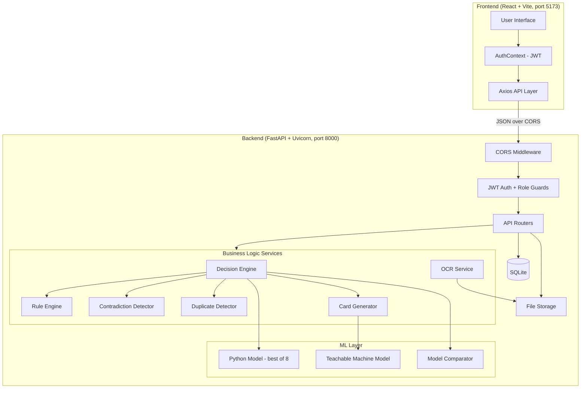
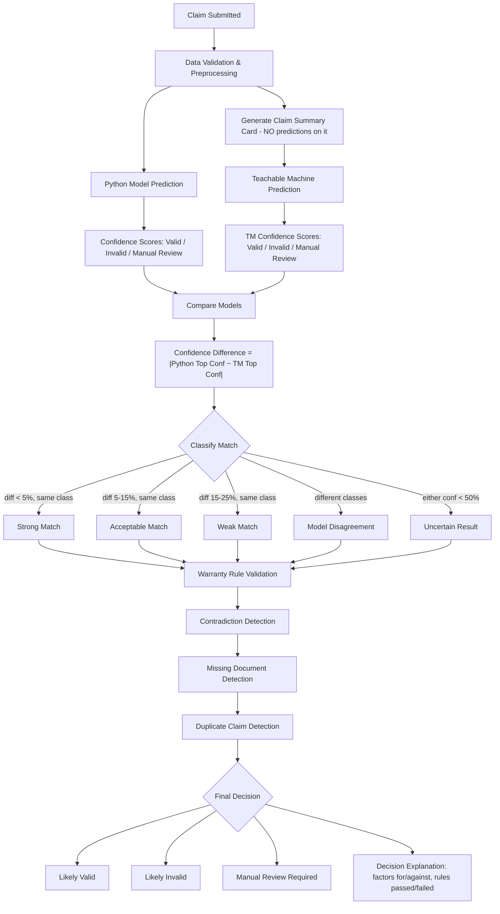
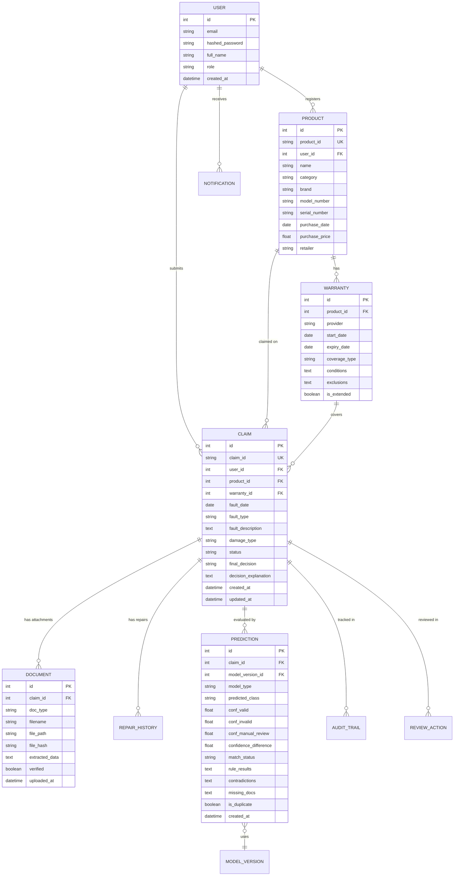
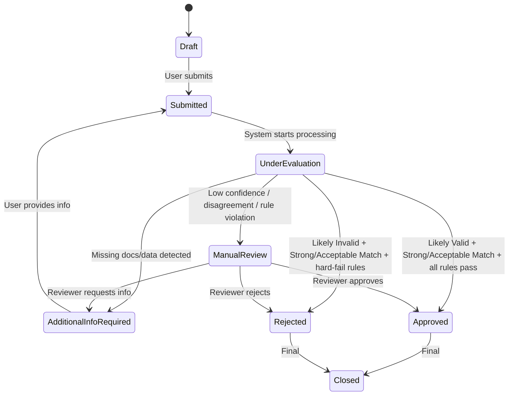

# AssureX Claim Engine — Comprehensive Analysis

## 1. Project Identity at a Glance

| Dimension | Value |
|---|---|
| **Theme** | AI-Powered Document Ops |
| **Category** | NextWave AI and ML |
| **Core Problem** | Automate warranty claim validation using dual-model AI + business rules |
| **Stack** | FastAPI + React (Vite) + SQLite + scikit-learn/XGBoost/LightGBM + Google Teachable Machine + pytesseract |
| **Dataset** | 2,500 synthetic claim records, stratified 70/15/15 |
| **Models** | 8 Python classifiers + 1 Google Teachable Machine image classifier |
| **Output** | 3-class decision: Likely Valid / Likely Invalid / Manual Review Required |
| **Timeline** | 5 competition days |

---

## 2. Architecture Overview



---

## 3. The Decision Pipeline — The Heart of the App

This is the **single most critical flow** evaluators will probe. Every team member must be able to walk through it:



> [!IMPORTANT]
> The Claim Summary Card **must NOT contain** the Python prediction, confidence score, or final decision. This is stated **three separate times** in the SRS (Steps 7, 20, and Deliverable 5). Violating this is a likely disqualification trigger.

---

## 4. Role-Based Access Matrix

| Feature | Customer | Employee | Reviewer | Admin |
|---|:---:|:---:|:---:|:---:|
| Register/Login | ✅ | ✅ | ✅ | ✅ |
| Register Products | ✅ | ✅ | ❌ | ✅ |
| Manage Warranties | ✅ | ✅ | ❌ | ✅ |
| Upload Documents | ✅ | ✅ | ❌ | ✅ |
| Create Claims | ✅ | ✅ | ❌ | ✅ |
| View Own Claims | ✅ | ✅ | ❌ | ✅ |
| View All Claims | ❌ | ✅ | ✅ | ✅ |
| Manual Review Queue | ❌ | ❌ | ✅ | ✅ |
| Approve/Reject/Override | ❌ | ❌ | ✅ | ✅ |
| Admin Dashboard | ❌ | ❌ | ❌ | ✅ |
| Configure Policies/Thresholds | ❌ | ❌ | ❌ | ✅ |
| Export Data (CSV/Excel) | ❌ | ❌ | ❌ | ✅ |
| Notifications | ✅ | ✅ | ✅ | ✅ |

---

## 5. Database Entity Map



---

## 6. SRS Requirements Cross-Reference & Risk Analysis

### 6.1 High-Risk / Commonly Missed Requirements

| # | SRS Requirement | Risk Level | Why It's Risky |
|---|---|:---:|---|
| xxiv | Model Consistency Status (Strong/Acceptable/Weak/Disagreement/Uncertain) | 🔴 HIGH | Requires configurable thresholds, not hardcoded if/else |
| xxvi | Configurable Warranty Policies (JSON/YAML, not hardcoded) | 🔴 HIGH | Evaluators will check that adding a new policy doesn't require code changes |
| xxviii | Contradiction Detection | 🔴 HIGH | Must catch: fault before purchase, repair before purchase, claim after fault date contradictions |
| xxx-xxxi | Duplicate Claim + Document Detection (hash-based) | 🟡 MEDIUM | Need both field-matching AND file-hash dedup |
| xlviii | Model Version Tracking | 🟡 MEDIUM | Each prediction must record which model version was used; updating model must not alter old results |
| xxxvii | Reviewer Override with Audit History | 🟡 MEDIUM | Original AI result must persist even after human override |
| l | Monitoring & Anomaly Alerts | 🟡 MEDIUM | Failed uploads, repeated login attempts, low confidence patterns |
| xxxiii | Claim Preparation Assistance | 🟢 LOW | Pre-submission guidance (missing docs, contradictions, deadlines) |

### 6.2 Build Plan vs SRS Gap Analysis

| Gap | In Build Plan? | In SRS? | Action Needed |
|---|:---:|:---:|---|
| User Profile Management (FR ii) | ❌ | ✅ | Add profile CRUD endpoint + page |
| Repair History Management (FR xiii) | Partial | ✅ | Full CRUD for repair records linked to claims |
| Document Organization (FR xiv) | ❌ | ✅ | View/download/replace/remove docs by access rights |
| Claim Preparation Assistance (FR xxxiii) | ❌ | ✅ | Pre-submission checklist showing gaps |
| AI-Generated Claim Summary (FR xxxii) | ❌ | ✅ | Auto-generated narrative summary of claim |
| Monitoring & Anomaly Alerts (FR l) | ❌ | ✅ | Admin alerts for suspicious patterns |
| Data Analysis & Reporting (FR xliii) | Partial | ✅ | Analytics on faults, rejections, patterns |
| Cross-validation results (Deliverable 4) | ❌ | ✅ | Add k-fold CV to training pipeline |
| Feature importance analysis (Deliverable 4) | ❌ | ✅ | Add feature importance for tree-based models |

---

## 7. Dataset Schema — Full Field Inventory

The 2,500-record dataset must include these fields (derived from SRS + build plan):

| Field | Type | Notes |
|---|---|---|
| `claim_id` | string | Unique, format `CLM-XXXXX` |
| `product_id` | string | Links to product |
| `product_name` | string | |
| `product_category` | string | Electronics / Appliances / Automotive / etc. |
| `brand` | string | |
| `model_number` | string | |
| `serial_number_entered` | string | What the user typed |
| `serial_number_on_receipt` | string | What OCR extracted — deliberately mismatched in ~10% |
| `serial_number_on_warranty_card` | string | Third source — mismatches create review triggers |
| `purchase_date` | date | |
| `purchase_price` | float | |
| `retailer` | string | |
| `warranty_start` | date | |
| `warranty_end` | date | |
| `warranty_provider` | string | |
| `warranty_type` | string | Standard / Extended |
| `fault_date` | date | Sometimes before purchase_date (contradiction!) |
| `claim_submission_date` | date | |
| `fault_type` | string | Manufacturing / Wear / Accidental / etc. |
| `fault_description` | string | |
| `damage_type` | string | Physical / Electrical / Water / etc. |
| `product_age_months` | int | Derived |
| `remaining_warranty_days` | int | Derived |
| `repair_history_count` | int | 0–5 |
| `previous_repair_authorized` | bool | False = unauthorized repair → likely invalid |
| `receipt_uploaded` | bool | |
| `warranty_card_uploaded` | bool | |
| `product_image_uploaded` | bool | |
| `fault_evidence_uploaded` | bool | |
| `repair_report_uploaded` | bool | |
| `missing_doc_count` | int | Derived |
| `serial_mismatch_flag` | bool | Derived |
| `excluded_damage` | bool | Damage type in exclusion list |
| `duplicate_claim_flag` | bool | For test cases |
| `class_label` | string | Valid Claim / Invalid Claim / Manual Review |

---

## 8. Model Comparison Strategy

### 8.1 The 8 Python Models

| # | Algorithm | Library | Key Hyperparams to Tune | Expected Strength |
|---|---|---|---|---|
| 1 | Logistic Regression | sklearn | C, penalty, max_iter | Interpretable baseline, good with linear separability |
| 2 | Decision Tree | sklearn | max_depth, min_samples_split | Shows overfitting — useful for comparison narrative |
| 3 | Random Forest | sklearn | n_estimators, max_depth, max_features | Strong ensemble, resists overfitting |
| 4 | XGBoost | xgboost | learning_rate, n_estimators, max_depth | Usually best — captures feature interactions |
| 5 | LightGBM | lightgbm | num_leaves, learning_rate, n_estimators | Faster than XGBoost, similar performance |
| 6 | SVM | sklearn | C, kernel, gamma | Different algorithm family for diversity |
| 7 | KNN | sklearn | n_neighbors, weights, metric | Distance-based baseline — likely weakest |
| 8 | Naive Bayes | sklearn | var_smoothing | Fast probabilistic baseline |

### 8.2 Evaluation Metrics (per SRS)

- Accuracy, Precision, Recall, F1-score (weighted — Manual Review is the hard class)
- Confusion matrix for all 8
- Cross-validation results (SRS Deliverable 4 — **often missed**)
- Feature importance (for tree-based models)
- Class-wise performance breakdown

### 8.3 Google Teachable Machine

- Image classification on Claim Summary Cards
- 3 classes: Valid / Invalid / Manual Review
- Training images: ≥2 variants per training record = ≥3,500 images
- Val/Test: 1 card per record, never used for training
- Export: TensorFlow/Keras or TF.js model

---

## 9. Warranty Rule Engine Design

Policies stored in `policies/` as JSON files. **Not hardcoded.** Structure:

```json
{
  "policy_id": "POL-ELECTRONICS-001",
  "product_category": "Electronics",
  "coverage_duration_months": 24,
  "warranty_start_condition": "purchase_date",
  "covered_faults": ["Manufacturing", "Electrical", "Software"],
  "exclusions": ["Accidental", "Water", "Cosmetic", "Unauthorized Modification"],
  "claim_reporting_period_days": 30,
  "max_repairs_before_replacement": 3,
  "authorized_service_required": true,
  "mandatory_documents": ["receipt", "warranty_card", "fault_evidence"],
  "hard_fail_rules": [
    "warranty_expired",
    "excluded_damage",
    "no_purchase_proof"
  ],
  "warning_rules": [
    "serial_mismatch",
    "missing_optional_docs",
    "high_repair_count"
  ],
  "manual_review_rules": [
    "borderline_warranty",
    "contradictory_dates",
    "unauthorized_repair"
  ],
  "grace_period_days": 7,
  "replacement_conditions": {
    "min_repairs_for_replacement": 3,
    "max_product_age_months": 36
  }
}
```

Minimum 3 policies required (e.g., Electronics, Appliances, Automotive).

---

## 10. Confidence Comparison Thresholds (Configurable)

Stored in `config/thresholds.json`:

```json
{
  "strong_match": {
    "max_confidence_difference": 0.05,
    "require_same_class": true,
    "min_confidence": 0.70
  },
  "acceptable_match": {
    "max_confidence_difference": 0.15,
    "require_same_class": true,
    "min_confidence": 0.60
  },
  "weak_match": {
    "max_confidence_difference": 0.25,
    "require_same_class": true,
    "min_confidence": 0.50
  },
  "model_disagreement": {
    "require_same_class": false
  },
  "uncertain_result": {
    "min_confidence_below": 0.50
  }
}
```

---

## 11. Claim Status State Machine



---

## 12. Key Technical Decisions to Make Now

| Decision | Options | Recommendation | Rationale |
|---|---|---|---|
| CSS Framework | Bootstrap vs Tailwind | **Bootstrap** | Faster to scaffold, better component library for dashboards, less config |
| Teachable Machine export | TF.js vs Keras | **Keras (.h5)** | Runs server-side in Python — no need for Node.js runtime on backend |
| Card image generation | imgkit vs Pillow | **Pillow** | Zero external dependencies (imgkit needs wkhtmltoimage) |
| File storage | Filesystem vs DB blobs | **Filesystem** with paths in DB | Simpler, faster, supports direct serving |
| Notifications | WebSocket vs polling | **Polling on page load** | Simpler for 5-day sprint; in-app is sufficient per SRS |
| Deployment strategy | Separate (Render + Vercel) vs Single (FastAPI serves React build) | **Single service** | One deploy target, no CORS issues in production, simpler for evaluators |

---

## 13. Deliverables Checklist (SRS §1.10) — 16 Items

| # | Deliverable | Phase |
|---|---|---|
| 1 | Project Report (architecture, diagrams, model design, dataset, evaluation, security, limitations) | 5 |
| 2 | Source Code — public GitHub repo with full structure | 0–5 |
| 3 | Dataset — CSV train/val/test + card images + generator scripts + mapping file | 1 |
| 4 | Python Model Evidence — preprocessing, 8-model comparison, confusion matrices, saved model | 2 |
| 5 | Google Teachable Machine Evidence — screenshots, exported model, test results | 3 |
| 6 | Model Comparison Report — 30+ unseen test claims with full field list | 4 |
| 7 | Warranty Policy Files — min 3, JSON/YAML, not hardcoded | 1 |
| 8 | Test Cases — functional, integration, boundary, negative, security, DB, OCR, rule engine | 4 |
| 9 | Installation Instructions in README | 5 |
| 10 | Execution Instructions in README | 5 |
| 11 | GitHub Repository — meaningful multi-day commits, README, AI_USAGE.md, LICENSE | 0–5 |
| 12 | Deployed Application URL + credentials | 4 |
| 13 | Demonstration Video (.mp4) | 5 |
| 14 | Technical Blog (2,000+ words) | 5 |
| 15 | AI_USAGE.md — continuous | 0–5 |
| 16 | Team Contribution Record | 5 |

---

## 14. Risk Register

| Risk | Impact | Likelihood | Mitigation |
|---|:---:|:---:|---|
| Teachable Machine model accuracy < 85% | 🔴 | Medium | Generate more/better card variants, ensure class balance, retrain |
| CORS issues between React and FastAPI | 🟡 | High | Configure CORS on day 0, test with actual cross-origin requests immediately |
| OCR extraction quality on synthetic receipts | 🟡 | Medium | Generate clean synthetic receipts; allow manual correction (FR vii) |
| Dataset too clean — models overfit | 🟡 | Medium | Deliberately inject noise, missing values, contradictions |
| Time crunch on Day 4–5 | 🔴 | High | Prioritize decision engine + review workflow over polish features |
| Evaluator surprise modification | 🟡 | Certain | Practice one modification live before evaluation day |
| Single large commit at end | 🔴 | Medium | Commit after every phase, set reminders |

---

## 15. Refined Day-by-Day Timeline

| Day | Morning | Afternoon | Evening | Commits |
|---|---|---|---|---|
| **1** | Phase 0: Scaffold repo, backend, frontend, Git init | Phase 1a: Dataset generator (2,500 records) | Phase 1b: Card image generator + stratified split | 4-6 commits |
| **2** | Phase 2: Train 8 models, comparison table, select best | Phase 3: Teachable Machine training (manual, screenshots) | Phase 4 start: Auth + Products + Warranties CRUD | 5-7 commits |
| **3** | Phase 4: Document upload + OCR + Claim creation | Phase 4: Decision engine (Python + TM + rules + comparison) | Phase 4: Manual review workflow + status tracking | 5-7 commits |
| **4** | Phase 4: Dashboards + search/filter + notifications | Phase 5: Test cases + hardening | Phase 6: Deploy (single-service strategy) | 4-6 commits |
| **5** | Phase 7: README, model comparison report, AI_USAGE.md | Phase 7: Project report, blog draft | Phase 7: Demo video, final commit sweep, rehearse explanations | 3-5 commits |

---

## 16. Ready-to-Execute Phase 0 Plan

When you say "go," I will execute the following in order:

1. **Initialize Git** in the workspace
2. **Scaffold the full directory structure** per the build plan
3. **Backend setup**: FastAPI + SQLModel + SQLite + CORS + `/health` route + `requirements.txt` + `.gitignore`
4. **Frontend setup**: Vite + React + React Router + Bootstrap + axios wrapper + AuthContext + placeholder Login/Dashboard pages
5. **Create template files**: `README.md`, `AI_USAGE.md`, `devlog.md`, `LICENSE`
6. **Warranty policy files**: 3 JSON policies (Electronics, Appliances, Automotive)
7. **Config files**: Confidence thresholds, app settings
8. **First commit**: "Phase 0: Project scaffold — backend + frontend + configs"

> [!TIP]
> Say **"Start Phase 0"** when you're ready, and I'll build the entire scaffold in one go.
